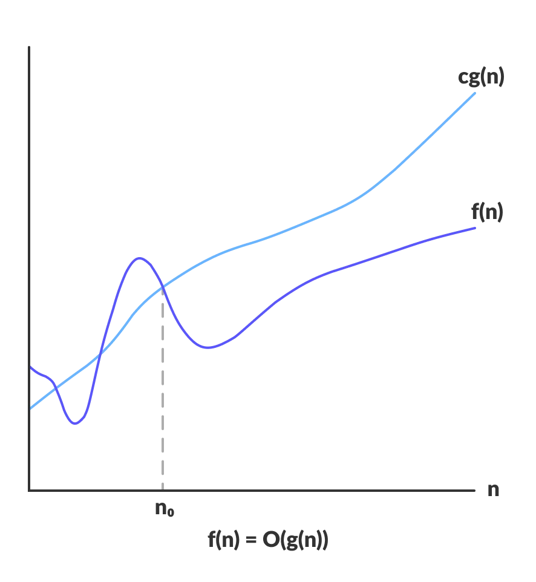

A **computer program** is **a collection of instructions** to **perform a specific task**. For this, a computer program may need to store data, retrieve data, and perform computations on the data.
- A **data structure** is **a named location** that can be used to store and organize data.
- An **algorithm** is **a collection of steps** to solve a particular problem.
- Learning data structures and algorithms allow us to **write efficient and optimized computer programs**.

#### What is an Algorithm?
- It is **a set of well-defined instructions** to solve a particular problem. 
- It **takes a set of input(s)** and **produces the desired output**.

#### Qualities of a Good Algorithm
- **Input and output** should be **defined precisely**.
- **Each step** in the algorithm should be **clear and unambiguous**.
- Algorithms should be **most effective** among many different ways to solve a problem.
- An algorithm **shouldn't include computer code**. Instead, the algorithm should be written in such a way that it can be used in different programming languages.

#### What are Data Structures?
- It is **a storage** that is used to **store and organize data**.
- It is **a way of arranging data** on a computer so that it can be accessed and updated efficiently.
- Data structure and **data types** are slightly different. Data structure is **the collection of data types** arranged in a specific order.

#### Types of Data Structure
- Linear data structure
  - The elements are **arranged in sequence one after the other**.
  - Since elements are arranged in particular order, they are easy to implement. 
- Non-linear data structure
  - The elements are not in any sequence.
  - Instead they are arranged in a hierarchical manner where one element will be connected to one or more elements.

#### Linear data structures
1. [Array Data Structure](./linear-data-structures/array.md)
    - In an array, elements in memory are arranged in continuous memory. 
    - All the elements of an array are of the same type. 
    - The type of elements that can be stored in the form of arrays is determined by the programming language.
2. [Linked List Data Structure](./linear-data-structures/linked-list.md)
    - Elements are connected through a series of nodes. And, each node contains the data items and address to the next node.
3. [Stack Data Structure](./linear-data-structures/stack.md)
    - Elements are stored in the LIFO principle. That is, the last element stored in a stack will be removed first.
    - It works just like a pile of plates where the last plate kept on the pile will be removed first.
4. [Queue Data Structure](./linear-data-structures/queue-by-array.md)
    - Elements are stored in the FIFO principle where first element stored in the queue will be removed first.
    - It works just like a queue of people in the ticket counter where first person on the queue will get the ticket first.

#### Non linear data structures
1. Graph Data Structure
    - Spanning Tree and Minimum Spanning Tree
    - Strongly Connected Components
    - Adjacency Matrix
    - Adjacency List
2. Trees Data Structure
    - Binary Tree
    - Binary Search Tree
    - AVL Tree
    - B-Tree
    - B+ Tree
    - Red-Black Tree

| Linear Data Structures | Non Linear Data Structures |
| :--- | :--- |
| The data items are arranged in sequential order, one after the other. | The data items are arranged in non-sequential order (hierarchical manner). |
| All the items are present on the single layer. | The data items are present at different layers. |
| It can be traversed on a single run. That is, if we start from the first element, we can traverse all the elements sequentially in a single pass. | It requires multiple runs. That is, if we start from the first element it might not be possible to traverse all the elements in a single pass. |
| The memory utilization is not efficient. | Different structures utilize memory in different efficient ways depending on the need. |
| The time complexity increase with the data size. | Time complexity remains the same. |
| Arrays, Stack, Queue | Tree, Graph, Map |

#### Why Learn Data Structures and Algorithms?
- Programming is all about data structures and algorithms. Data structures are used to hold data while algorithms are used to solve the problem using that data.
- Data structures and algorithms (DSA) goes through solutions to standard problems in detail and gives you an insight into how efficient it is to use each one of them. It also teaches you the science of evaluating the efficiency of an algorithm. This enables you to choose the best of various choices.

> Note: <mark>Scalability is scale plus ability, which means the quality of an algorithm/system to handle the problem of larger size.</mark>

#### Asymptotic Analysis
- The efficiency of an algorithm depends on the amount of time, storage and other resources required to execute the algorithm. 
- The efficiency is measured with the help of asymptotic notations.
- The study of change in performance of the algorithm with the change in the order of the input size is defined as asymptotic analysis.

#### Asymptotic Notations
- Asymptotic notations are the mathematical notations used to describe the running time of an algorithm when the input tends towards a particular value or a limiting value.
- Notations
  1. Big-O Notation
  2. Omega notation
  3. Theta notation

#### Big-O Notation (O-notation)
- Big-O notation represents the upper bound of the running time of an algorithm. Thus, it gives the worst-case complexity of an algorithm.
- Since it gives the worst-case running time of an algorithm, it is widely used to analyze an algorithm as we are always interested in the worst-case scenario.

#### Omega Notation (Ω-notation)
- Omega notation represents the lower bound of the running time of an algorithm. Thus, it provides the best case complexity of an algorithm.

#### Theta Notation (Θ-notation)
- Theta notation encloses the function from above and below. Since it represents the upper and the lower bound of the running time of an algorithm.
- It is used for analyzing the average-case complexity of an algorithm.

#### Master Theorem
- The master method is a formula for solving recurrence relations of the form.
- The master theorem is used in calculating the time complexity of recurrence relations (divide and conquer algorithms) in a simple and quick way.

#### Divide and Conquer Algorithm
- A divide and conquer algorithm is a strategy of solving a large problem by
    - breaking the problem into smaller sub-problems
    - solving the sub-problems, and
    - combining them to get the desired output.
- To use the divide and conquer algorithm, recursion is used.
- The complexity of the **divide and conquer algorithm** is calculated using the **master theorem**.

#### How Divide and Conquer Algorithms Work?
1. **Divide**: Divide the given problem into sub-problems using recursion.
2. **Conquer**: Solve the smaller sub-problems recursively. If the subproblem is small enough, then solve it directly.
3. **Combine**: Combine the solutions of the sub-problems that are part of the recursive process to solve the actual problem.

#### Divide and Conquer Vs Dynamic approach
- The divide and conquer approach divides a problem into smaller subproblems; these subproblems are further solved recursively. The result of each subproblem is not stored for future reference, whereas, in a dynamic approach, the result of each subproblem is stored for future reference.
- Use the divide and conquer approach when the same subproblem is not solved multiple times. Use the dynamic approach when the result of a subproblem is to be used multiple times in the future.

#### Advantages of Divide and Conquer Algorithm
- The complexity for the multiplication of two matrices using the naive method is O(n3), whereas using the divide and conquer approach (i.e. Strassen's matrix multiplication) is O(n2.8074). This approach also simplifies other problems, such as the Tower of Hanoi.
- This approach is suitable for multiprocessing systems.
- It makes efficient use of memory caches.

#### Divide and Conquer Applications
1. Binary Search
2. Merge Sort
3. Quick Sort
4. Strassen's Matrix multiplication
5. Karatsuba Algorithm

### Linear Data Structures
- [Array](./linear-data-structures/array.md)
- [Linked List](./linear-data-structures/linked-list.md)
- [Stack](./linear-data-structures/stack.md)
  - [Solutions](./linear-data-structures/stack-solutions.md)
- Queue
  - [By Array](./linear-data-structures/queue-by-array.md)
  - [By Linked List](./linear-data-structures/queue-by-linked.md) 
  - [Solutions](./linear-data-structures/queue-solutions.md)
- [Hash Tables](./linear-data-structures/hash-table.md)
  - [By linear probing](./linear-data-structures/hash-table-linear-probing.md)
  - [Solutions](./linear-data-structures/hash-table-solutions.md)

### Non-Linear Data Structures
- [Tree and Binary Tree](./non-linear-data-structures/binary-tree.md)
- [AVL Tree](./non-linear-data-structures/avl-tree.md)
- [Heap](./non-linear-data-structures/heap.md)
  - [Solutions](./non-linear-data-structures/heap-solutions.md)
- [Trie](./non-linear-data-structures/trie.md)

### Algorithms
- [Sorting](./algorithms/sorting.md)
- [Searching](./algorithms/searching.md)
- [String Manipulation](./algorithms/string-manipulation.md)

