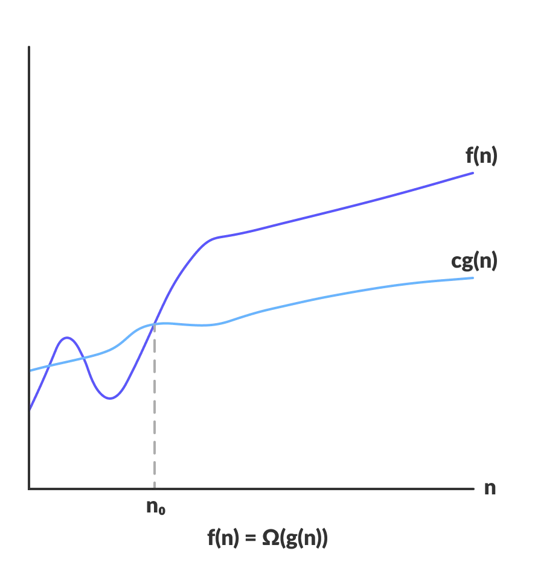

#### Asymptotic Notations

-   Asymptotic notations are the **mathematical notations** used to describe the **running time of an algorithm** when the input tends towards a particular value or a limiting value.
-   Notations
    1. Big-O Notation
    2. Omega notation
    3. Theta notation

#### Asymptotic Analysis

-   The efficiency of an algorithm depends on the amount of time, storage and other resources required to execute the algorithm.
-   The efficiency is measured with the help of asymptotic notations.
-   The study of change in performance of the algorithm with the change in the order of the input size is defined as asymptotic analysis.

| Definition                  | Shape |
| --------------------------- | :---: |
| Big-O Notation (O-notation) <ul><li>Big-O Notation is a **mathematical notation** that describes the **limiting bahavior** of a function when the **argument tends towards a particular value or infinity**.</li><li>We use Big-O Notation to describe the **performance of an algorithm**.</li><li>We need **opproximation cost of an algorithem** in Big-O, so we can **drop constant value**.</li><li>Big-O notation represents **the upper bound of the running time of an algorithm**. Thus, it gives the worst-case complexity of an algorithm.</li><li>Since it gives the worst-case running time of an algorithm, it is widely used to analyze an algorithm as we are always interested in the worst-case scenario.</li><ul> |       |
| Omega Notation (Ω-notation) <ul><li>Omega notation represents **the lower bound of the running time of an algorithm**. Thus, it provides the best case complexity of an algorithm.</li><ul> |       |
| Theta Notation (Θ-notation) <ul><li>Theta notation encloses the function from above and below. Since it represents **the upper and the lower bound of the running time of an algorithm**.</li><li>It is used for analyzing the average-case complexity of an algorithm.</li><ul> |       |

#### Some popular complexities of an algorithm

| Name        | Approximation |
| :---------- | :-----------: |
| Constant    |     $(n)$     |
| Logarithmic |  $O(\log n)$  |
| Linear      |    $O(n)$     |
| Quadratic   |   $O(n^2)$    |
| Exponential |   $O(2^n)$    |
