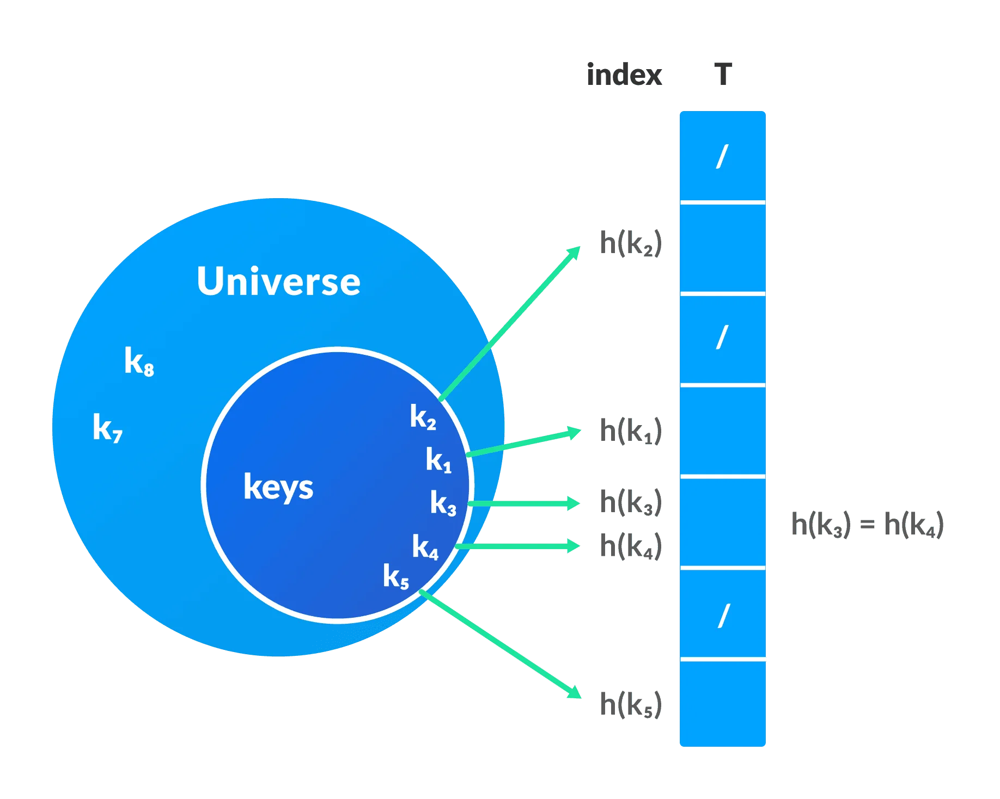
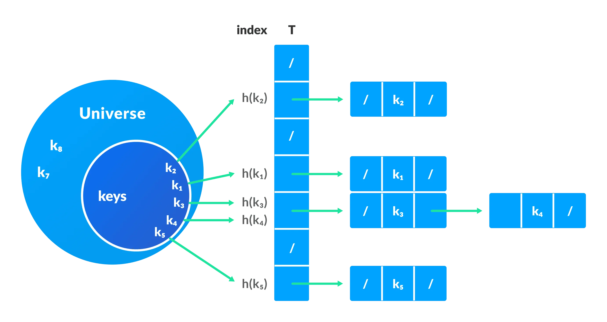

#### Hash Table

-   The Hash table data structure **stores elements in key-value pairs** where:
    -   **Key**: unique integer that is used for indexing the values.
    -   **Value**: data that are associated with keys.


-   Collision solving
    -   Chaining
    -   Open Addressing
        -   Linear Probing
        -   Quadratic Probing
        -   Double Hashing
-   Applications
    -   Constant time lookup and insertion is required
    -   Indexing data is required
    -   Spell checkers
    -   Dictionaries
    -   Compilers
    -   Code Editors
-   Languages
    -   Java &rarr; HashMap
    -   C# &rarr; Dictionary
    -   Python &rarr; Dictionary
    -   JavaScript &rarr; Object

#### Hashing (Hash Function)

-   In a hash table, a new index is processed using the keys. And, the element corresponding to that key is stored in the index.
-   This process is called **hashing**.



#### Hash Collision

-   When the hash function generates the same index for multiple keys, there will be a **conflict** (what value to be stored in that index).
-   This is called a **hash collision**.
-   We can resolve the hash collision using one of the following techniques.
    -   Collision resolution by chaining
    -   Open Addressing
        -   Linear Probing
        -   Quadratic Probing
        -   Double Hashing

#### 1. Chaining

-   In chaining, if a hash function produces the same index for multiple elements, these elements are stored in the same index by using a **doubly-linked list**.



#### 2. Open Addressing

-   Unlike chaining, open addressing doesn't store multiple elements into the same slot.
-   **Linear Probing**
    -   In linear probing, collision is resolved by checking the next slot.
    -   The problem with linear probing is that a cluster of adjacent slots is filled. When inserting a new element, the entire cluster must be traversed. This adds to the time required to perform operations on the hash table.
        1. <mark>$h(k, i) = (h′(k) + i) \mod m$</mark>
        2. <mark>$i = \{0, 1, ….\}$</mark>
        3. <mark>$h'(k)$</mark> is a new hash function
        4. If a collision occurs at <mark>$h(k, 0)$</mark>, then <mark>$h(k, 1)$</mark> is checked. In this way, the value of i is incremented linearly.
-   **Quadratic Probing**
    -   It works similar to linear probing but the spacing between the slots is increased (greater than one) by using the following relation.
        1. <mark>$h(k, i) = (h′(k) + c_1i + c_2i^2) \mod m$ </mark>
        2. <mark>$c_1$</mark> and <mark>$c_2$</mark> are positive auxiliary constants
        3. <mark>$i = \{0, 1, ….\}$</mark>
-   **Double hashing**
    -   If a collision occurs after applying a hash function $h(k)$, then another hash function is calculated for finding the next slot.
        1. <mark>$h(k, i) = (h_1(k) + ih_2(k)) \mod m$</mark>

#### Good Hash Functions

1. Division Method
    - If k is a key and m is the size of the hash table, the hash function h() is calculated as:
    - <mark>$h(k) = k \mod m$</mark>
2. Multiplication Method
    - <mark>$h(k) = ⌊m(kA \mod 1)⌋$</mark>
    - <mark>$kA \mod 1$</mark> gives the fractional part <mark>$kA$</mark>
    - <mark>$⌊ ⌋$</mark> gives the floor value
    - `A` is any constant. The value of `A` lies between 0 and 1. But, an optimal choice will be <mark>$≈ (\sqrt{5} - 1)/2$</mark> suggested by Knuth.
3. Universal Hashing
    - In Universal hashing, the hash function is chosen at random independent of keys.

| Operation | Approximation |
| :-------- | :-----------: |
| Lookup    |    $O(1)$     |
| Insert    |    $O(1)$     |
| Delete    |    $O(1)$     |

---

#### Q: Create a `Hash Table` is composed of the following methods:

-   [x] [put](#a-put)
-   [x] [get](#a-get)
-   [x] [remove](#a-remove)

---

#### A: Structure of a hash table

```Java
public class HashTable {
    private class Entry {
        private int key;
        private String value;

        public Entry(int key, String value) {
            this.key = key;
            this.value = value;
        }
    }

    private LinkedList<Entry>[] entries;

    public HashTable(int capacity) {
        if (capacity <= 0 )
            throw new IllegalArgumentException();

        entries = new LinkedList[capacity];
    }
}
```

---

#### A: put

```Java
private int hash(int key) {
    return key % entries.length;
}

private LinkedList<Entry> bucket(int key) {
    if (entries[hash(key)] == null)
        entries[hash(key)] = new LinkedList<>();

    return entries[hash(key)];
}

private Entry entry(int key) {
    var bucket = bucket(key);
    for (var entry : bucket) {
        if (entry.key == key)
            return entry;
    }

    return null;
}

public void put(int key, String value) {
    var entry = entry(key);
    if (entry != null) {
        entry.value = value;
        return;
    }

    var bucket = bucket(key);
    bucket.add(new Entry(key, value));
}
```

---

#### A: get

```Java
public String get(int key) {
    var entry = entry(key);

    return entry == null ? null : entry.value;
}
```

---

#### A: remove

```Java
public void remove(int key) {
    var entry = entry(key);
    if (entry == null)
        throw new IllegalStateException();

    var bucket = bucket(key);
    bucket.remove(entry);
}
```
