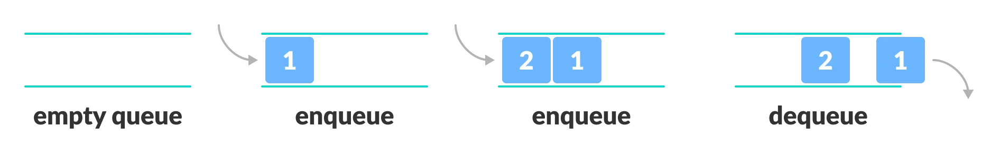

#### Queue
- A line of items. 
- A queue is a linear data structure that follows the principle of **First In First Out (FIFO)**. This means the first element inserted inside the queue is removed first.
- Usages
  - CPU scheduling, Disk Scheduling
  - When data is transferred asynchronously between two processes.The queue is used for synchronization. For example: IO Buffers, pipes, file IO, etc
  - Handling of interrupts in real-time systems.
  - Call Center phone systems use Queues to hold people calling them in order. 

#### FIFO Principle of Stack
In programming terms, putting items in the queue is called <mark>enqueue</mark>, and removing items from the queue is called <mark>dequeue</mark>.


#### Basic Operations of Queue
1. `enqueue`: Add an element to the end of the queue.
2. `dequeue`: Remove an element from the front of the queue.
3. `peek`: Get the value of the front of the queue without removing it.
4. `isEmpty`: Check if the queue is empty.
5. `isFull`: Check if the queue is full.

| Operation | Approximation |
| :--- | :---: |
| Lookup | $O(1)$ |
| Insert | $O(1)$ |
| Delete | $O(1)$ |

---
#### Q: Create a queue is composed of the following methods:
- [x] [enqueue](#a-enqueue)
- [x] [dequeue](#a-dequeue)
- [x] [peek](#a-peek)
- [x] [isEmpty](#a-isempty)
- [x] [isFull](#a-isfull)
- [x] [size](#a-size)

---
#### A: Structure of a stack
```Java
public class Queue {
    private int[] items;
    private int rear;
    private int front;
    private int count;

    public Queue(int capacity) {
        if (capacity < 0)
            throw new IllegalArgumentException();

        items = new int[capacity];
    }

    @Override
    public String toString() {
        return Arrays.toString(items);
    }
}
```
---
#### A: enqueue
```Java
public void enqueue(int item) {
    if (isFull()) 
        throw new IllegalStateException();

    items[rear] = item;
    rear = (rear + 1) % items.length;
    count++;
}
```
---
#### A: dequeue
```Java
public int dequeue() {
    if (isEmpty()) 
        throw new IllegalStateException();

    var item = items[front];
    items[front] = 0;
    front = (front + 1) % items.length;
    count--;

    return item;
}
```
---
#### A: peek
```Java 
public int peek() {
    if (isEmpty()) 
        throw new IllegalStateException();
        
    return items[front];
}
```
---
#### A: isEmpty
```Java
public boolean isEmpty() {
    return count == 0;
}
```
---
#### A: isFull
```Java
public boolean isFull() {
    return count == items.length;
}
```
---
#### A: size
```Java
public int size() {
    return count;
}
```
