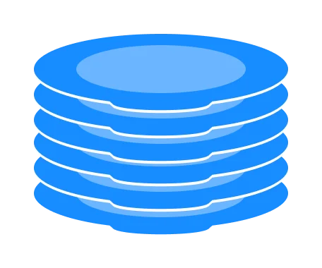

#### Stack
- A stack is a linear data structure that follows the principle of **Last In First Out (LIFO)**. This means the last element inserted inside the stack is removed first.
- The most common **stack implementation** is using <mark>Arrays</mark>, but it can also be implemented using <mark>Linked Lists</mark>.
- Usages 
  - Implement the **undo feature**.
  - Build **compilers** (e.g. syntax checking).
  - **Evaluate expressions** (e.g. 1+2*3).
  - **Build navigation** (e.g. forward/back).
- You can **think of** the stack data structure as **the pile of plates on top of another**.


#### LIFO Principle of Stack
- In programming terms, putting an item on top of the stack is called push and removing an item is called pop.


#### Basic Operations of Stack
1. `push`: Add an element to the top of a stack.
2. `pop`: Remove an element from the top of a stack.
3. `peek`: Get the value of the top element without removing it.
4. `isEmpty`: Check if the stack is empty.
5. `isFull`: Check if the stack is full.

| Operation | Approximation |
| :--- | :---: |
| Lookup | $O(1)$ |
| Insert | $O(1)$ |
| Delete | $O(1)$ |

---
#### Q: Create a stack is composed of the following methods:
- [x] [push](#a-push)
- [x] [pop](#a-pop)
- [x] [peek](#a-peek)
- [x] [isEmpty](#a-isempty)
- [x] [isFull](#a-isfull)
- [x] [size](#a-size)

---
#### A: Structure of a stack
```Java
public class Stack {
    private int[] items;
    private int count;

    public Stack(int capacity) {
        if (capacity < 0)
            throw new IllegalArgumentException();

        items = new int[capacity];
    }

    public void print() {
        for(int i = 0; i < count; i++)
            System.out.println(items[i]);
    }

    @Override
    public String toString() {
        var newItems = Arrays.copyOfRange(items, 0, count);
        return Arrays.toString(newItems);
    }
}
```
---
#### A: push
```Java
public void push(int item) {
    if (isFull())
        throw new StackOverflowError();

    items[count++] = item;
}
```
---
#### A: pop
```Java
public int pop() {
    if (isEmpty())
        throw new IllegalStateException();

    return items[--count];
}
```
---
#### A: peek
```Java
public int peek() {
    if (isEmpty())
        throw new IllegalStateException();

    return items[count - 1];
}
```
---
#### A: isEmpty
```Java
public boolean isEmpty() {
    return count == 0;
}
```
---
#### A: isFull
```Java
public boolean isFull() {
    return count == items.length;
}
```
---
#### A: size
```Java
public int size() {
    return count;
}
```