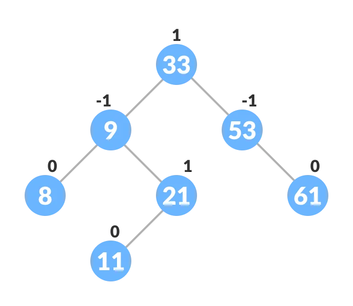

#### AVL Tree

-   It is a special kind of **Binary Search Tree (BST)** that automatically **rebalance themself** every time we add or remove node.
-   AVL tree is a self-balancing binary search tree in which each node maintains extra information called a balance factor whose value is either -1, 0 or +1.
-   The self balancing property of an avl tree is maintained by the balance factor. The value of balance factor should always be -1, 0 or +1.
-   AVL tree got its name after its inventor **Georgy Adelson-Velsky and Landis**.
-   Applications
    1. For indexing large records in databases
    2. For searching in large databases

#### Balance Factor

-   Balance factor of a node in an AVL tree is the difference between the height of the left subtree and that of the right subtree of that node.
    ```Java
        int balanceFactor = (leftHeight  - rightHeight);
        int balanceFactor = (rightHeight  - leftHeight);
    ```
    
-   Rotations
    -   Left (**LL**)
    -   Right (**RR**)
    -   Left-Right (**LR**)
    -   Right-Left (**RL**)

#### Self-Balancing Trees

-   AVL Trees
-   Red-Black Trees
-   B-Trees
-   Splay Trees
-   2-3 Trees

| Time Complexity |             |
| :-------------- | :---------: |
| Operation       | Worst Case  |
| Lookup          | $O(\log n)$ |
| Insert          | $O(\log n)$ |
| Delete          | $O(\log n)$ |

---

#### Q: Create a AVL Tree is composed of the following methods:

-   [x] [insert](#a-insert)
-   [x] [isBalanced](#a-isbalanced)
-   [x] [isPerfect](#a-isperfect)

---

#### A: Structure of a Binary Tree

```Java
public class AVLTree {
    private class AVLNode {
        private int height;
        private int value;
        private AVLNode leftChild;
        private AVLNode rightChild;

        public AVLNode(int value) {
            this.value = value;
        }

        @Override
        public String toString() {
            return "Node: " + value;
        }
    }

    private AVLNode root;
}
```

---

#### A: insert

```Java
// Setting height
private void setHeight(AVLNode node) {
    node.height = Math.max(height(node.leftChild), height(node.rightChild)) + 1;
}

private int height(AVLNode node) {
    return (node == null) ? -1 : node.height;
}

// Balance tree
private int balanceFactor(AVLNode node) {
    return (node == null) ? 0 : height(node.leftChild) - height(node.rightChild);
}

private boolean isLeftHeavy(AVLNode node) {
    return balanceFactor(node) > 1;
}

private boolean isRightHeavy(AVLNode node) {
    return balanceFactor(node) < -1;
}

private AVLNode rotateLeft(AVLNode root) {
    var newRoot = root.rightChild;

    root.rightChild = newRoot.leftChild;
    newRoot.leftChild = root;

    setHeight(root);
    setHeight(newRoot);

    return newRoot;
}

private AVLNode rotateRight(AVLNode root) {
    var newRoot = root.leftChild;

    root.leftChild = newRoot.rightChild;
    newRoot.rightChild = root;

    setHeight(root);
    setHeight(newRoot);

    return newRoot;
}

private AVLNode balance(AVLNode root) {
    if (isLeftHeavy(root)) {
        if (balanceFactor(root.leftChild) < 0)
            root.leftChild = rotateLeft(root.leftChild);

      return rotateRight(root);
    } else if (isRightHeavy(root)) {
        if (balanceFactor(root.rightChild) > 0)
            root.rightChild = rotateRight(root.rightChild);

        return rotateLeft(root);
    }

    return root;
}

// Insert
public void insert(int value) {
    root = insert(root, value);
}

private AVLNode insert(AVLNode root, int value) {
    if (root == null)
        return new AVLNode(value);

    if (value < root.value) root.leftChild = insert(root.leftChild, value);
    else root.rightChild = insert(root.rightChild, value);

    setHeight(root);

    return balance(root);
}
```

---

#### A: isBalanced

```Java
public boolean isBalanced() {
    return isBalanced(root);
}

private boolean isBalanced(Node root) {
    if (root == null)
        return true;

    var balanceFactor = height(root.leftChild) - height(root.rightChild);

    return
        Math.abs(balanceFactor) <= 1 &&
        isBalanced(root.leftChild) &&
        isBalanced(root.rightChild);
}
```

---

#### A: isPerfect

```Java
private boolean isLeaf(Node node) {
    return node.leftChild == null && node.rightChild == null;
}

public int size() {
    return size(root);
}

private int size(Node root) {
    if (root == null)
        return 0;

    if (isLeaf(root))
        return 1;

    return 1 + size(root.leftChild) + size(root.rightChild);
}

public boolean isPerfect() {
    return size() == Math.pow(2, height() + 1) - 1;
}
```
