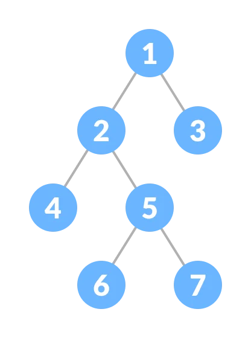

#### Binary Tree

-   Binary Tree is a Tree that every node has **maximum two children**.
-   Binary Tree is a Tree in which each parent node can have **at most two children**.
-   Each node of a Binary Tree consists of **three items**:
    1.  data item
    2.  address of left child
    3.  address of right child
        
        
-   Types

    -   Perfect Binary Tree
    -   Full Binary Tree
    -   Complete Binary Tree
        -   Heap
    -   Balanced Binary Tree
    -   Binary Search Tree
        -   AVL Tree
    -   Degenerate or Pathological Tree
    -   Skewed Binary Tree
        1.  Right Skewed Binary Tree
        2.  Left Skewed Binary Tree

    ```mermaid
        graph TD;
            Binary-Tree-->Perfect-Binary-Tree;
            Binary-Tree-->Full-Binary-Tree;
            Binary-Tree-->Complete-Binary-Tree-->Heap;
            Binary-Tree-->Balanced-Binary-Tree;
            Binary-Tree-->Binary-Search-Tree-->AVL-Tree;
            Binary-Tree-->Degenerate-Tree;
            Binary-Tree-->Skewed-Binary-Tree;
            Skewed-Binary-Tree-->Left-Skewed-Binary-Tree;
            Skewed-Binary-Tree-->Right-Skewed-Binary-Tree;
    ```

#### Applications

1.  For easy and quick access to data
2.  In **router algorithms**
3.  To **implement heap** data structure
4.  Syntax tree

#### Perfect Binary Tree

-   A Perfect Binary Tree is a type of Binary Tree in which **every internal node** has exactly **two child nodes** and all the leaf nodes are **at the same level**.
-   Recursively, a Perfect Binary Tree can be defined as:
    1. If a single node has no children, it is a Perfect Binary Tree of height `h = 0`.
    2. If a node has `h > 0`, it is a Perfect Binary Tree if both of its subtrees are of height `h - 1` and are non-overlapping.
-   Theorems
    1. A Perfect Binary Tree of height `h` has <mark>$2^{(h + 1)} – 1$</mark> node.
    2. A Perfect Binary Tree with n nodes has height <mark>$\log(n + 1) – 1 = \theta(\ln(n))$</mark>.
    3. A Perfect Binary Tree of height h has <mark>$2^h$</mark> leaf nodes.
    4. The average depth of a node in a Perfect Binary Tree is $Θ(ln(n))$.
       
       

#### Full Binary Tree

-   Full Binary Tree is a special type of Binary Tree in which every `parent node`/`internal node` has **either two or no children**, every level except the **last level** is full of nodes.
-   Theorems

    1.  `i` = the number of **internal nodes**
    2.  `n` = the total number of **nodes**
    3.  `l` = the number of **leaves**
    4.  `λ` = the number of **levels**
    5.  The number of leaves is <mark>$i + 1$</mark>.
    6.  The total number of nodes is <mark>$2i + 1$</mark>.
    7.  The number of internal nodes is <mark>$(n – 1) / 2$</mark>.
    8.  The number of leaves is <mark>$(n + 1) / 2$</mark>.
    9.  The total number of nodes is <mark>$2l – 1$</mark>.
    10. The number of internal nodes is <mark>$l – 1$</mark>.
    11. The number of leaves is at most <mark>$2\lambda - 1$</mark>.

        

#### Complete Binary Tree

-   A Complete Binary Tree is just like a Full Binary Tree, but with two major differences
    1.  Every level must be completely filled.
    2.  All the leaf elements must lean towards the left.
    3.  The last leaf element might not have a right sibling i.e. a Complete Binary Tree doesn't have to be a Full Binary Tree.
-   Every level except the **last level** is **completely filled** and the levels **are filled from the left to the right**.
-   Relationship between array indexes in Complete Binary Tree:
    1.  Parent <mark>$i$</mark>
    2.  Left child <mark>$2i + 1$</mark>
    3.  Right child <mark>$2i + 2$</mark>
-   Applications
    -   Heap-based data structures
    -   Heap sort
        

#### Balanced Binary Tree

-   It is a type of Binary Tree in which the difference between **the height of the left and the right subtree** for each node is **either 0 or 1**.
-   A Balanced Binary Tree, also referred to as a **Height-Balanced Binary Tree**, is defined as a binary tree in which the height of the left and right subtree of any node differ by **not more than one**.
    ```Java
        height(left) - height(right) <= 1
    ```
-   Following are the conditions for a Height-Balanced Binary Tree:

    1. Difference between the left and the right subtree for any node is not more than one.
    2. The left subtree is balanced.
    3. The right subtree is balanced.

-   Balanced Binary Tree Applications

    -   Balanced Binary Search Tree
    -   AVL Tree

    

#### Binary Search Tree

-   Binary Search Tree is a data structure that quickly allows us to maintain a sorted list of numbers.

    1. It is called a **Binary Tree** because each tree node **has a maximum of two children**.
    2. It is called a **Search Tree** because it **can be used to search** for the presence of a number in <mark>$O(\log(n))$</mark> time.

-   **Left** Node **<** **Root** Node **<** **Right** Node.

#### Degenerate or Pathological Tree

-   A Degenerate or Pathological Tree is the tree having a single child either left or right.
    

#### Skewed Binary Tree

-   A Skewed Binary Tree is a Degenerate/Pathological Tree in which the tree is either dominated by the left nodes or the right nodes.
    

| Operation | Approximation |
| :-------- | :-----------: |
| Lookup    |  $O(\log n)$  |
| Insert    |  $O(\log n)$  |
| Delete    |  $O(\log n)$  |

---

#### Q: Create a Binary Tree is composed of the following methods:

-   [x] [structure](#a-structure-of-a-binary-tree)
-   [x] [insert](#a-insert)
-   [x] [contains](#a-contains)
-   [x] [pre-order](#a-pre-order)
-   [x] [in-order](#a-in-order-asc) - ASC
-   [x] [in-order](#a-in-order-desc) - DESC
-   [x] [post-order](#a-post-order)
-   [x] [height ✸](#a-height)
-   [x] [min ✸](#a-min)
-   [x] [max ✸](#a-max)
-   [x] [equals ✸](#a-equals)
-   [x] [isBST ✸](#a-isbst)
-   [x] [getNodesAtDistance ✸](#a-getnodesatdistance)
-   [x] [level-order ✸](#a-level-order)
-   [x] [size ✸](#a-size)
-   [x] [countLeaves ✸](#a-countleaves)
-   [x] [contains ✸](#a-contains)
-   [x] [isBalanced ✸](#a-isbalanced)
-   [x] [isPerfect ✸](#a-isperfect)
-   [x] [areSibling ✸](#a-aresibling)
-   [x] [getAncestors ✸✸](#a-getancestors)

---

#### A: Structure of a Binary Tree

```Java
public class BinaryTree {
    private class Node {
        private int value;
        private Node leftChild;
        private Node rightChild;

        public Node(int value) {
            this.value = value;
        }

        @Override
        public String toString() {
            return "Node: " + value;
        }
    }

    private Node root;
}
```

---

#### A: insert

```Java
// BST insert
public void insert(int value) {
    var node = new Node(value);

    if (root == null) {
      root = node;
      return;
    }

    var current = root;
    while (true) {
        if (value <= current.value) {
            if (current.leftChild == null) {
                current.leftChild = node;
                break;
            }
            current = current.leftChild;
        } else {
            if (current.rightChild == null) {
                current.rightChild = node;
                break;
            }
            current = current.rightChild;
        }
    }
}
```

---

#### A: contains

```Java
public boolean contains(int value) {
    return contains(root, value);
}

private boolean contains(Node root, int value) {
    if (root == null)
        return false;

    if (root.value == value)
        return true;

    return contains(root.leftChild, value) || contains(root.rightChild, value);
}
```

---

#### A: pre-order

```Java
public void traversePreOrder() {
    traversePreOrder(root);
}

private void traversePreOrder(Node root) {
    if (root == null)
      return;

    System.out.println(root.value);
    traversePreOrder(root.leftChild);
    traversePreOrder(root.rightChild);
}
```

---

#### A: in-order-asc

```Java
public void traverseInOrder() {
    traverseInOrder(root);
}

private void traverseInOrder(Node root) {
    if (root == null)
      return;

    traverseInOrder(root.leftChild);
    System.out.println(root.value);
    traverseInOrder(root.rightChild);
}
```

---

#### A: in-order-desc

```Java
public void traverseInOrder() {
    traverseInOrder(root);
}

private void traverseInOrder(Node root) {
    if (root == null)
      return;

    traverseInOrder(root.rightChild);
    System.out.println(root.value);
    traverseInOrder(root.leftChild);
}
```

---

#### A: post-order

```Java
public void traversePostOrder() {
    traverseInOrder(root);
}

private void traversePostOrder(Node root) {
    if (root == null)
      return;

    traversePostOrder(root.leftChild);
    traversePostOrder(root.rightChild);
    System.out.println(root.value);
}
```

---

#### A: height

```Java
private boolean isLeaf(Node node) {
    return node.leftChild == null && node.rightChild == null;
}

public int height() {
    return height(root);
}

private int height(Node root) {
    if (root == null) return -1;
    if (isLeaf(root)) return 0;

    return 1 + Math.max(
        height(root.leftChild),
        height(root.rightChild));
}
```

---

#### A: min

```Java
// O(n) -> BT
public int min() {
    if (root == null)
        throw new IllegalStateException();

    return min(root);
}

public int min(Node root) {
    if (isLeaf(root))
        return root.value;

    int left = root.value;
    int right = root.value;
    if (root.leftChild != null) left = min(root.leftChild);
    if (root.rightChild != null) right = min(root.rightChild);

    return Math.min(Math.min(left, right), root.value);
}
```

---

#### A: max

```Java
public int max() {
    if (root == null)
        throw new IllegalStateException();

    return max(root);
}

public int max(Node root) {
    if (isLeaf(root))
        return root.value;

    int left = root.value;
    int right = root.value;
    if (root.leftChild != null) left = max(root.leftChild);
    if (root.rightChild != null) right = max(root.rightChild);

    return Math.max(Math.max(left, right), root.value);
}
```

---

#### A: equals

```Java
public boolean equals(BinaryTree other) {
    if (other == null)
        return false;

    return equals(root, other.root);
}

private boolean equals(Node first, Node second) {
    if (first == null && second == null)
        return true;

    if (first != null && second != null)
        return
            first.value == second.value &&
            equals(first.leftChild, second.leftChild) &&
            equals(first.rightChild, second.rightChild);

    return false;
}
```

---

#### A: isBST

```Java
public boolean isBST() {
    return isBST(root, Integer.MIN_VALUE, Integer.MAX_VALUE);
}

private boolean isBST(Node root, int min, int max) {
    if (root == null)
        return true;

    if (root.value < min || root.value > max)
        return false;

    return
        isBST(root.leftChild, min, root.value - 1) &&
        isBST(root.rightChild, root.value + 1, max);
}
```

---

#### A: getNodesAtDistance

```Java
public ArrayList<Integer> getNodesAtDistance(int distance) {
    var list = new ArrayList<Integer>();
    getNodesAtDistance(root, distance, list);
    return list;
}

private void getNodesAtDistance(Node root, int distance, ArrayList<Integer> list) {
    if (root == null)
        return;

    if (distance == 0) {
        list.add(root.value);
        return;
    }

    getNodesAtDistance(root.leftChild, distance - 1, list);
    getNodesAtDistance(root.rightChild, distance - 1, list);
}
```

#### A: level-order

```Java
public void traverseLevelOrder() {
    for (var i = 0; i <= height(); i++) {
        for (var value : getNodesAtDistance(i))
            System.out.println(value);
    }
}
```

---

#### A: size

```Java
public int size() {
    return size(root);
}

private int size(Node root) {
    if (root == null)
        return 0;

    if (isLeaf(root))
        return 1;

    return 1 + size(root.leftChild) + size(root.rightChild);
}
```

---

#### A: countLeaves

```Java
public int countLeaves() {
    return countLeaves(root);
}

private int countLeaves(Node root) {
    if (root == null)
        return 0;

    if (isLeaf(root))
        return 1;

    return countLeaves(root.leftChild) + countLeaves(root.rightChild);
}
```

---

#### A: isBalanced

```Java
public boolean isBalanced() {
    return isBalanced(root);
}

private boolean isBalanced(Node root) {
    if (root == null)
        return true;

    var balanceFactor = height(root.leftChild) - height(root.rightChild);

    return
        Math.abs(balanceFactor) <= 1 &&
        isBalanced(root.leftChild) &&
        isBalanced(root.rightChild);
}
```

---

#### A: isPerfect

```Java
public boolean isPerfect() {
    return size() == Math.pow(2, height() + 1) - 1;
}
```

---

#### A: areSibling

```Java
public boolean areSibling(int first, int second) {
    return areSibling(root, first, second);
}

private boolean areSibling(Node root, int first, int second) {
    if (root == null)
        return false;

    var areSibling = false;
    if (root.leftChild != null && root.rightChild != null) {
        areSibling =
            (root.leftChild.value == first && root.rightChild.value == second) ||
            (root.rightChild.value == first && root.leftChild.value == second);
    }

    return areSibling ||
        areSibling(root.leftChild, first, second) ||
        areSibling(root.rightChild, first, second);
}
```

---

#### A: getAncestors

```Java
public List<Integer> getAncestors(int value) {
    var list = new ArrayList<Integer>();
    getAncestors(root, value, list);
    return list;
  }

private boolean getAncestors(Node root, int value, List<Integer> list) {
    if (root == null)
        return false;

    if (root.value == value)
        return true;

    if (getAncestors(root.leftChild, value, list) ||
        getAncestors(root.rightChild, value, list)) {
        list.add(root.value);
        return true;
    }

    return false;
}
```
