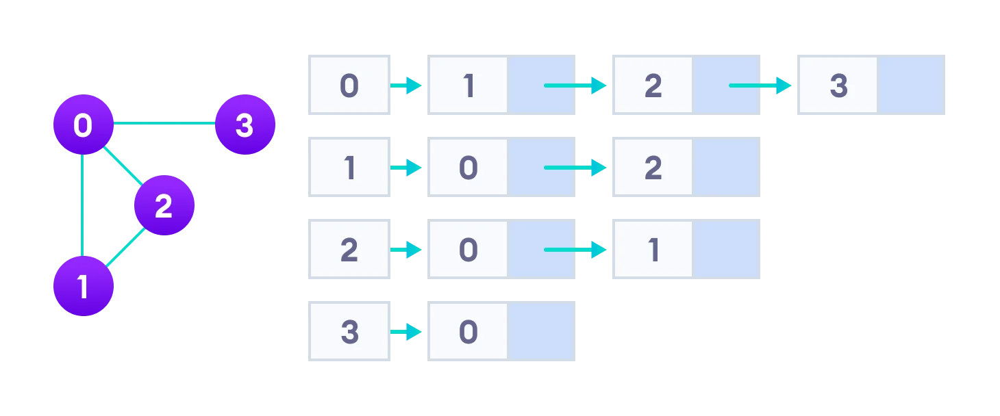

#### Graph

-   A Graph Data Structure is a **collection of nodes** that have data and are connected to other nodes, every relationship is an edge from one node to another.
-   A Graph is a Data Structure (V, E) that consists of
    -   A **collection of vertices** V
    -   A **collection of edges** E
    -   represented as ordered pairs of vertices (u,v)
-   A **Graph** is one of the most versatile Data Structures because they allow us to solve really interesting problems, It is used in **Social Networks, GPS**, basically anywhere you want to **model the relationship between a bunch of objects**.

|                                Graph                                 |
| :------------------------------------------------------------------: |
|                                        |
|                             **V, E, G**                              |
| V = {0, 1, 2, 3}<br/>E = {(0,1), (0,2), (0,3), (1,2)}<br/>G = {V, E} |

#### Graph Terminology

-   **Adjacency**: A vertex is said to be adjacent to another vertex if there is an edge connecting them.
-   **Path**: A sequence of edges that allows you to go from vertex A to vertex B is called a path.
-   **Directed Graph**: A graph in which an edge (u,v) doesn't necessarily mean that there is an edge (v, u) as well. The edges in such a graph are represented by arrows to show the direction of the edge.

#### Graph Representation - two ways to implement a graph

-   **Adjacency Matrix**
    -   An adjacency matrix is a **two dimensional array** or **2D array of V x V vertices**. Each row and column represent a vertex.
    -   An adjacency list is efficient in terms of storage because we only need to store the values for the edges. For a graph with millions of vertices, this can mean a lot of saved space.
        | Adjacency Matrix |
        | :------------------------------------------------------------------: |
        |  |
        | <table><tbody><tr><td>Node</td><td>$O(n)$</td></tr><tr><td>Vertice</td><td>$O(v)$</td></tr><tr><td>Edge</td><td>$O(e)$</td></tr></tbody></table><table><thead><tr><th>Name</th><th>Time Complexity</th></tr></thead><tbody><tr> <td>Space</td><td>$O(n^2)$=$O(v^2)$</td></tr><tr><td>Add Node</td><td>$O(n^2)$=$O(v^2)$</td></tr><tr><td>Remove Node</td><td>$O(n^2)$=$O(v^2)$</td></tr><tr><td>Add Edge</td><td>$O(1)$</td></tr><tr><td>Remove Edge</td><td>$O(1)$</td></tr><tr><td>Query Edge</td><td>$O(1)$</td></tr><tr><td>Find Neighbors</td><td>$O(v)$</td></tr></tbody></table> |
-   **Adjacency List**
    -   An Adjacency List represents a graph as an **array of linked lists**.
    -   The index of the array represents a vertex and each element in its linked list represents the other vertices that form an edge with the vertex.
        | Adjacency List |
        | :------------------------------------------------------------------: |
        |  |
        | <table><tbody><tr><td>Node</td><td>$O(n)$</td></tr><tr><td>Vertice</td><td>$O(v)$</td></tr><tr><td>Edge</td><td>$O(e)$</td></tr><tr><td>A number of edges, a node has</td><td>$O(k)$</td></tr></tbody></table><table><thead><tr><th>Name</th><th>Time Complexity</th><th>Time Complexity - Worst Case</th></tr></thead><tbody><tr> <td>Space</td><td>$O(v)$=$O(v+e)$</td><td>$O(v)$=$O(v+e)$=$O(v+v^2)$=$O(v^2)$</td></tr><tr><td>Add Node</td><td>$O(1)$</td><td></td></tr><tr><td>Remove Node</td><td>$O(v)$=$O(v+e)$</td><td>$O(v)$=$O(v+e)$=$O(v+v^2)$=$O(v^2)$</td></tr><tr><td>Add Edge</td><td>$O(k)$</td><td>$O(v)$</td></tr><tr><td>Remove Edge</td><td>$O(k)$</td><td>$O(v)$</td></tr><tr><td>Query Edge</td><td>$O(k)$</td><td>$O(v)$</td></tr><tr><td>Find Neighbors</td><td>$O(k)$</td><td>$O(v)$</td></tr></tbody></table> |

#### Graph Operations

-   Check if the element is present in the graph
-   Graph Traversal
-   Add elements(vertex, edges) to graph
-   Finding the path from one vertex to another

#### Types

-   Undirected Graph
    -   An **Undirected Graph** is a graph in which the edges do not point in any direction (ie. **the edges are bidirectional**).
    
-   Connected Graph
    -   A **Connected Graph** is a graph in which there is always a path from a vertex to any other vertex.
    
-   Dense Graph
-   Sparse Graph
-   Weighted Graph
-   Directed Graph
-   Cyclic Graph
-   Acyclic Graph
-   ...

#### Graph Traversal

-   **Depth first**: Start from a node and recursively visit all of his neighbors, going really deep in a graph.
-   **Breadth first**: Visit a node and all these neighbors before going farther that node with implementing a queue.

#### Topological Sorting

-   Does not produce unique result.
-   Only works on graphs without a cycle
-   Do Depth-First traversal with stack.

#### Q: Create a Graph is composed of the following methods:

-   [x] [structure](#a-structure-of-a-graph)
-   [x] [add node](#a-add-node)
-   [x] [add edge](#a-add-edge)
-   [x] [remove node](#a-remove-node)
-   [x] [remove edge](#a-remove-edge)
-   [x] [traverse depth first - recursive](#a-traverse-depth-first---recursive)
-   [x] [traverse depth first - iterative](#a-traverse-depth-first---iterative)
-   [x] [traverse breadth first](#a-traverse-breadth-first)
-   [x] [topological sort](#a-topological-sort)
-   [x] [has cycle](#a-has-cycle)

---

#### A: Structure of a Graph

```Java
public class Graph {
    private class Node {
        private String label;

        public Node(String label) {
            this.label = label;
        }

        @Override
        public String toString() {
            return label;
        }
    }

    private Map<String, Node> nodes = new HashMap<>();
    private Map<Node, List<Node>> adjacencyList = new HashMap<>();

    public void print() {
        for (var source : adjacencyList.keySet()) {
            var targets = adjacencyList.get(source);
            if (!targets.isEmpty())
                System.out.println(source + " is connected to " + targets);
        }
    }
}
```

---

#### A: add node

```Java
public void addNode(String label) {
    var node = new Node(label);
    nodes.putIfAbsent(label, node);
    adjacencyList.putIfAbsent(node, new ArrayList<>());
}
```

---

#### A: add edge

```Java
public void addEdge(String from, String to) {
    var fromNode = nodes.get(from);
    if (fromNode == null)
        throw new IllegalArgumentException();

    var toNode = nodes.get(to);
    if (toNode == null)
        throw new IllegalArgumentException();

    adjacencyList.get(fromNode).add(toNode);
}
```

---

#### A: remove node

```Java
public void removeNode(String label) {
    var node = nodes.get(label);
    if (node == null)
        return;

    for (var n : adjacencyList.keySet())
        adjacencyList.get(n).remove(node);

    adjacencyList.remove(node);
    nodes.remove(node);
}
```

---

#### A: remove edge

```Java
public void removeEdge(String from, String to) {
    var fromNode = nodes.get(from);
    var toNode = nodes.get(to);

    if (fromNode == null || toNode == null)
      return;

    adjacencyList.get(fromNode).remove(toNode);
}
```

---

#### A: traverse depth first - recursive

```Java
// Recursive
public void traverseDepthFirst(String root) {
    var node = nodes.get(root);
    if (node == null)
      return;

    traverseDepthFirst(node, new HashSet<>());
}

private void traverseDepthFirst(Node root, Set<Node> visited) {
    System.out.println(root);
    visited.add(root);

    for (var node : adjacencyList.get(root))
        if (!visited.contains(node))
            traverseDepthFirst(node, visited);
}
```

---

#### A: traverse depth first - iterative

```Java
// Iterative
public void traverseDepthFirst(String root) {
    var node = nodes.get(root);
    if (node == null)
        return;

    Set<Node> visited = new HashSet<>();

    Stack<Node> stack = new Stack<>();
    stack.push(node);

    while (!stack.isEmpty()) {
        var current = stack.pop();

        if (visited.contains(current))
            continue;

        System.out.println(current);
        visited.add(current);

        for (var neighbour : adjacencyList.get(current))
            if (!visited.contains(neighbour))
                stack.push(neighbour);
    }
}
```

---

#### A: traverse breadth first

```Java
public void traverseBreadthFirst(String root) {
    var node = nodes.get(root);
    if (node == null)
      return;

    Set<Node> visited = new HashSet<>();

    Queue<Node> queue = new ArrayDeque<>();
    queue.add(node);

    while (!queue.isEmpty()) {
        var current = queue.remove();

        if (visited.contains(current))
            continue;

        System.out.println(current);
        visited.add(current);

        for (var neighbour : adjacencyList.get(current))
            if (!visited.contains(neighbour))
                queue.add(neighbour);
    }
}
```

---

#### A: topological sort

```Java
public List<String> topologicalSort() {
    Stack<Node> stack = new Stack<>();
    Set<Node> visited = new HashSet<>();

    for (var node : nodes.values())
        topologicalSort(node, visited, stack);

    List<String> sorted = new ArrayList<>();
    while (!stack.empty())
        sorted.add(stack.pop().label);

    return sorted;
}

private void topologicalSort(Node node, Set<Node> visited, Stack<Node> stack) {
    if (visited.contains(node))
        return;

    visited.add(node);

    for (var neighbour : adjacencyList.get(node))
        topologicalSort(neighbour, visited, stack);

    stack.push(node);
}
```

---

#### A: has cycle

```Java
public boolean hasCycle() {
    Set<Node> all = new HashSet<>();
    all.addAll(nodes.values());

    Set<Node> visiting = new HashSet<>();
    Set<Node> visited = new HashSet<>();

    while (!all.isEmpty()) {
        var current = all.iterator().next();
        if (hasCycle(current, all, visiting, visited))
            return true;
    }

    return false;
}

private boolean hasCycle(Node node, Set<Node> all, Set<Node> visiting, Set<Node> visited) {
    all.remove(node);
    visiting.add(node);

    for (var neighbour : adjacencyList.get(node)) {
        if (visited.contains(neighbour))
            continue;

        if (visiting.contains(neighbour))
            return true;

        if (hasCycle(neighbour, all, visiting, visited))
            return true;
    }

    visiting.remove(node);
    visited.add(node);

    return false;
}
```
