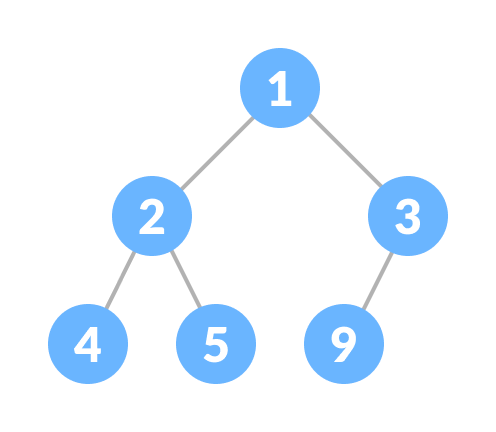

#### Heap

-   Heap is a **Complete Binary Tree** that satisfies the **heap property**, where any given node is:
    1.  always **greater than its child nodes** and the key of the root node is the largest among all other nodes. This property is also called **max heap property**.
    2.  always **smaller than the child nodes** and the key of the root node is the smallest among all other nodes. This property is also called **min heap property**.
-   Heap **is** a **Complete Binary Tree**.
-   Heap **has** a **Heap Property**.
-   Heap Property
    -   The root node has the **largest or smallest value**.
    -   `Max Heap Property`
        -   the value of every node is **greater than or equal to its children**.
    -   `Min Heap Property`
        -   the value of every node is **smaller than or equal to its children**.
-   This type of data structure is also called a **Binary Heap**.

|              Min Heap               |              Max Heap               |
| :---------------------------------: | :---------------------------------: |
|  |  |

-   Applications

    -   Sorting (Heap Sort)
    -   Priority Queues
    -   Graph algorithms (shortest path)
    -   Dijkstra's Algorithm
    -   Finding the kth smallest/largest value

-   Create a **complete binary tree from the array**:
    1. The index of **parent**: <mark>$n/2 - 1$</mark>
    2. The index of **left child**: <mark>$2i + 1$</mark>
    3. The index of **right child**: <mark>$2i + 2$</mark>

| Operation | Approximation |
| :-------- | :-----------: |
| Lookup    |  $O(\log n)$  |
| Insert    |  $O(\log n)$  |
| Delete    |  $O(\log n)$  |

---

#### Q: Create a Heap is composed of the following methods:

-   [x] [structure](#a-structure-of-a-binary-tree)
-   [x] [insert](#a-insert) - Insert for Max-Heap
-   [x] [remove](#a-remove) - remove for Max-Heap
-   [x] [peek](#a-peek) - Min in Min-Heap and Max in Max-Heap **without removing**
-   [x] [extract](#a-extract) - Min in Min-Heap and Max in Max-Heap **with removing**
-   [x] [isMaxHeap](#a-ismaxheap)
-   [x] [isMinHeap](#a-isminheap)

---

#### A: Structure of a Binary Tree

```Java
public class Heap {
    private int[] items;
    private int size;

    public Heap(int capacity) {
        if (capacity < 0)
            throw new IllegalArgumentException();

        this.items = new int[capacity];
    }

    private int parentIndex(int index) {
        return (index - 1) / 2;
    }

    private int leftChildIndex(int index) {
        return (index * 2) + 1;
    }

    private int rightChildIndex(int index) {
        return (index * 2) + 2;
    }

    private boolean hasLeftChild(int index) {
        return leftChildIndex(index) <= size;
    }

    private boolean hasRightChild(int index) {
        return rightChildIndex(index) <= size;
    }

    private int rightChild(int index) {
        return items[rightChildIndex(index)];
    }

    private int leftChild(int index) {
        return items[leftChildIndex(index)];
    }

    public boolean isEmpty() {
        return size == 0;
    }

    public boolean isFull() {
        return size == items.length;
    }
}
```

---

#### A: insert

```Java
private void swap(int first, int second) {
    var temp = items[first];
    items[first] = items[second];
    items[second] = temp;
}

private void bubbleUp() {
    var index = size - 1;
    while (index > 0 && items[index] > items[parentIndex(index)]) {
        swap(index, parentIndex(index));
        index = parentIndex(index);
    }
}

public void insert(int value) {
    if (isFull())
      throw new IllegalStateException();

    items[size++] = value;

    bubbleUp();
}
```

---

#### A: remove

```Java
private boolean isValidParent(int index) {
    if (!hasLeftChild(index))
      return true;

    var isValid = items[index] >= leftChild(index);

    if (hasRightChild(index))
        isValid &= items[index] >= rightChild(index);

    return isValid;
}

private int largerChildIndex(int index) {
    if (!hasLeftChild(index))
        return index;

    if (!hasRightChild(index))
        return leftChildIndex(index);

    return leftChild(index) > rightChild(index) ? leftChildIndex(index) : rightChildIndex(index);
}

private void bubbleDown() {
    var index = 0;
    while (index <= size && !isValidParent(index)) {
        var largerChildIndex = largerChildIndex(index);
        swap(index, largerChildIndex);
        index = largerChildIndex;
    }
}

public int remove() {
    if (isEmpty())
        throw new IllegalStateException();

    var root = items[0];
    items[0] = items[--size];

    bubbleDown();

    return root;
}
```

---

#### A: peek

```Java
public int peek() {
    if (isEmpty())
        throw new IllegalStateException();

    return items[0];
}
```

---

#### A: extract

```Java
public int extract() {
    if (isEmpty())
        throw new IllegalStateException();

    return remove();
}
```

---

#### A: isMaxHeap

```Java
public boolean isMaxHeap() {
    return isMaxHeap(0);
}

private boolean isMaxHeap(int index) {
    var lastParentIndex = (items.length - 2) / 2;
    if (index > lastParentIndex)
        return true;

    var leftChildIndex = leftChildIndex(index);
    var rightChildIndex = rightChildIndex(index);

    var isValidParent =
        items[index] >= items[leftChildIndex] &&
        items[index] >= items[rightChildIndex];

    return isValidParent &&
        isMaxHeap(leftChildIndex) &&
        isMaxHeap(rightChildIndex);
}
```

---

#### A: isMinHeap

```Java
public boolean isMinHeap() {
    return isMinHeap(0);
}

private boolean isMinHeap(int index) {
    var lastParentIndex = (items.length - 2) / 2;
    if (index > lastParentIndex)
        return true;

    var leftChildIndex = leftChildIndex(index);
    var rightChildIndex = rightChildIndex(index);

    var isValidParent =
        items[index] <= items[leftChildIndex] &&
        items[index] <>= items[rightChildIndex];

    return isValidParent &&
        isMinHeap(leftChildIndex) &&
        isMinHeap(rightChildIndex);
}
```
