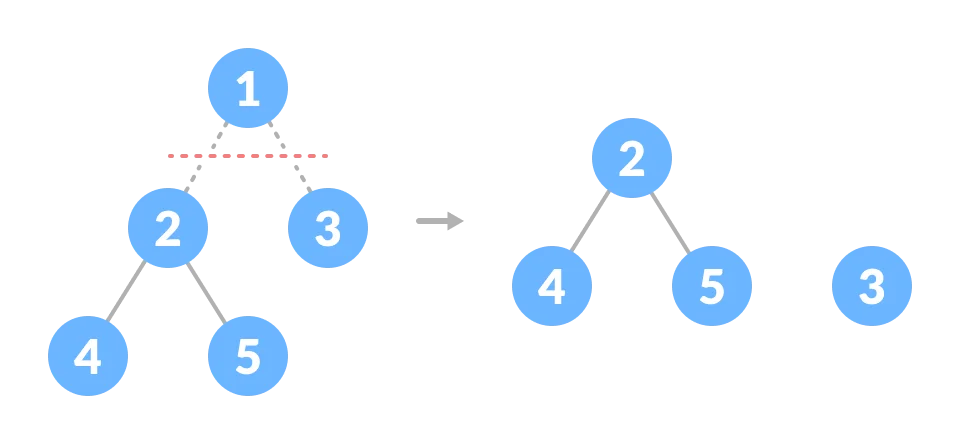
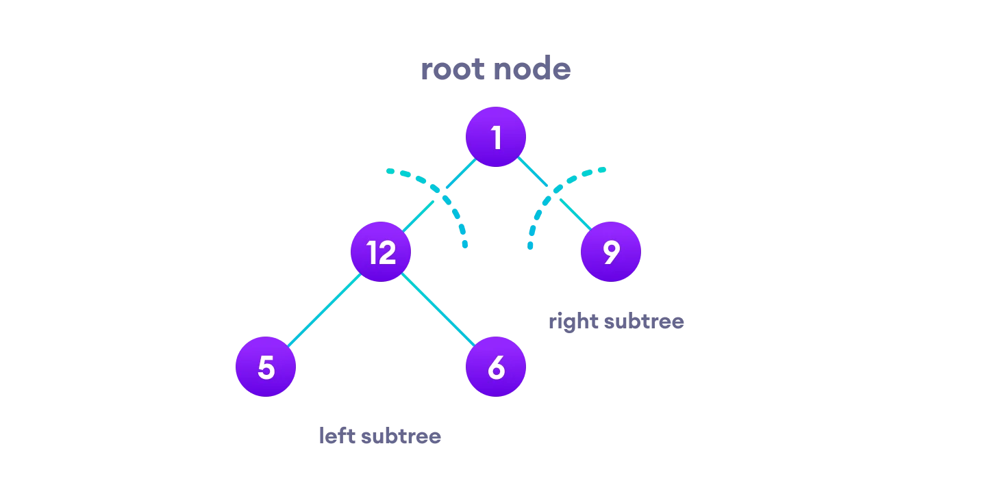
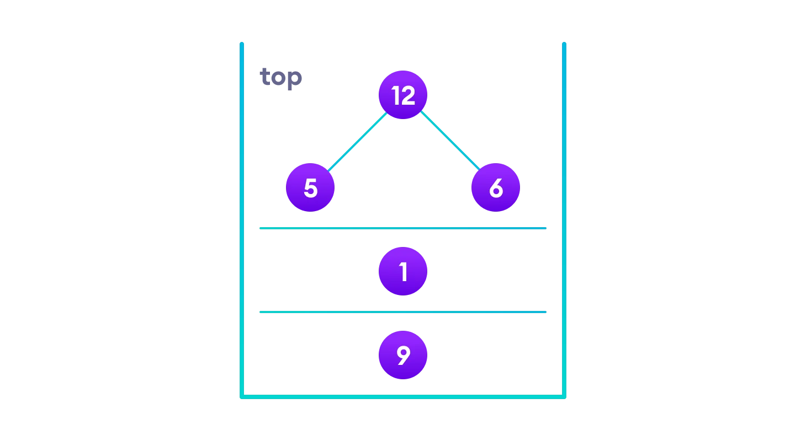
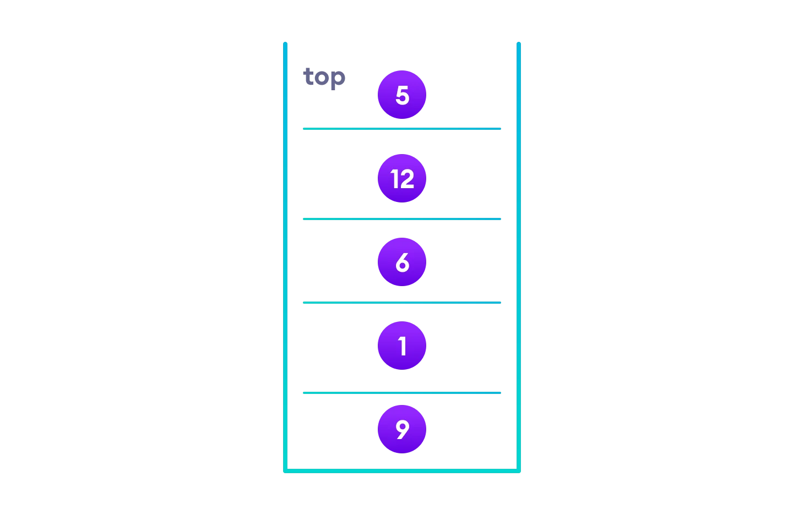

#### Tree

-   Tree is a Data Structure that **stores elements in a hierachy**.
-   Tree refers its elements as **Node** and **Line** that connects them as **Edges**.
-   A tree is **a nonlinear hierarchical data structure** that consists of nodes connected by edges.
    

#### Applications

1. Represents hierachical data
2. **Databases**
3. **Autocompletion**
4. **Compression** (JPEG, MP3)
5. **Compilers** use a syntax tree to validate the syntax of every program you write.
6. Heap is a kind of tree that is used for heap sort.
7. A modified version of a tree called Tries is used in modern routers to store routing information.
8. Most popular databases use B-Trees and T-Trees, which are variants of the tree structure we learned above to store their data

#### Why Tree Data Structure?

-   Other data structures such as arrays, linked list, stack, and queue are **linear data structures** that store data **sequentially**.
-   In order to perform any operation in a linear data structure, **the time complexity increases with the increase in the data size**. But, it is not acceptable in today's computational world.
-   Different tree data structures allow quicker and easier access to the data as it is a non-linear data structure.

#### Terminologies

1. `Node`
    - A node is an entity that contains a **key or value** and pointers to its child nodes.
    - The **last nodes of each path** are called **leaf nodes** or **external nodes** that do not contain a link/pointer to child nodes.
    - The node having **at least a child node** is called **an internal node**.
2. `Edge`
    - It is the **link** between any **two nodes**.
3. `Root`
    - It is **the topmost node** of a tree.
4. `Forest`
    - **A collection of disjoint trees** is called a forest.
    - You can create a forest by cutting the root of a tree.
      
5. `Height of a Node`
    - The height of a node is the number of edges from the node to the deepest leaf (ie. the longest path from the node to a leaf node).
6. `Degree of a Node`
    - The degree of a node is the total number of branches of that node.
7. `Depth of a Node`
    - The depth of a node is the number of edges from the root to the node.
    - From **Bottom to Top** (**BT**)
8. `Height of a Tree`
    - The height of a Tree is the height of the root node or the depth of the deepest node.
    - From **Top to Bottom** (**TB**)
    ```Java
       1 + max(height(Left), height(Right))
    ```
    

#### Tree Traversal

-   Traversing a tree means **visiting every node** in the tree.
-   Linear data structures like arrays, stacks, queues, and linked list have only one way to read the data. But a hierarchical data structure like a tree can be traversed in different ways.
-   Every tree is a combination of:
    1.  **A node carrying data**
    2.  **Two subtrees**
        
-   Traversing Types
    -   **Breadth first** (Level order)
    -   **Depth first**
        | Name | Direction | From To / Type |
        | :------------- | :-------------------: | :------------: |
        | Pre-order | **Root**, Left, Right | Root to Leafs |
        | In-order (LRR) | Left, **Root**, Right | ASC |
        | In-order (RRL) | Right, **Root**, Left | DESC |
        | Post-order | Left, Right, **Root** | Leafs to Root |
-   In-order traversal
    1.  First, visit all the nodes in **the `left`/right subtree**
    2.  Then **the root node**
    3.  Visit all the nodes in **the `right`/left subtree**
    ```Java
        inorder(root->left)
        display(root->data)
        inorder(root->right)
    ```
-   Pre-order traversal
    1.  Visit **root node**
    2.  Visit all the nodes in **the `left` subtree**
    3.  Visit all the nodes in **the `right` subtree**
    ```Java
        display(root->data)
        preorder(root->left)
        preorder(root->right)
    ```
-   Post-order traversal
    1.  Visit all the nodes in **the `left` subtree**
    2.  Visit all the nodes in **the `right` subtree**
    3.  Visit **the root node**
    ```Java
        postorder(root->left)
        postorder(root->right)
        display(root->data)
    ```
-   In traversing, putting everything on a **stack** was helpful because now that the left-subtree of the root node has been traversed, we can print it and go to the right subtree.
    
    
    
