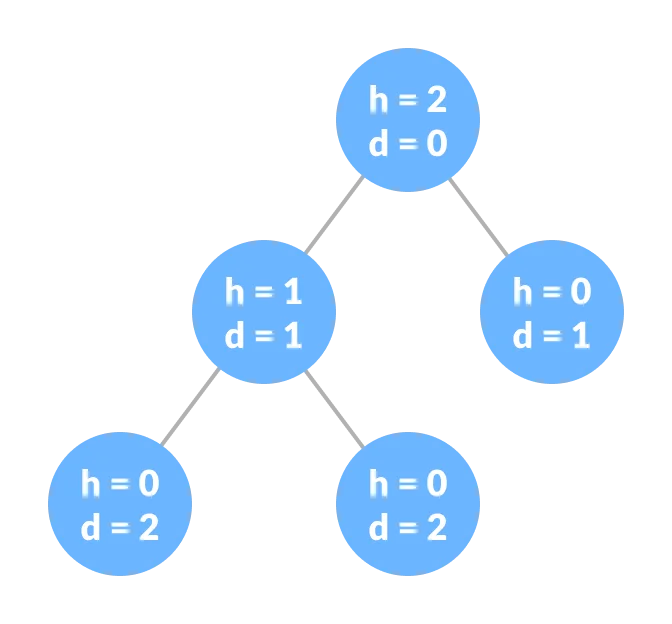

#### Tree

-   It is a Data Structure that **stores elements in a hierachy**.
-   It refers its elements as **Node** and **Line** that connects them as **Edges**.
-   A tree is a nonlinear hierarchical data structure that consists of nodes connected by edges.
    
-   Applications
    1. Represents hierachical data
    2. Databases
    3. Autocompletion
    4. Compilers
    5. Compression (JPEG, MP3)
    6. Binary Search Trees (BSTs) are used to quickly check whether an element is present in a set or not.
    7. Heap is a kind of tree that is used for heap sort.
    8. A modified version of a tree called Tries is used in modern routers to store routing information.
    9. Most popular databases use B-Trees and T-Trees, which are variants of the tree structure we learned above to store their data
    10. Compilers use a syntax tree to validate the syntax of every program you write.

#### Why Tree Data Structure?

-   Other data structures such as arrays, linked list, stack, and queue are linear data structures that store data sequentially.
-   In order to perform any operation in a linear data structure, the time complexity increases with the increase in the data size. But, it is not acceptable in today's computational world.
-   Different tree data structures allow quicker and easier access to the data as it is a non-linear data structure.

#### Terminologies

1. `Node`
    - A node is an entity that contains a **key or value** and pointers to its child nodes.
    - The **last nodes of each path** are called **leaf nodes** or **external nodes** that do not contain a link/pointer to child nodes.
    - The node having **at least a child node** is called **an internal node**.
2. `Edge`
    - It is the **link** between any **two nodes**.
3. `Root`
    - It is **the topmost node** of a tree.
4. `Forest`
    - A collection of disjoint trees is called a forest.
    - You can create a forest by cutting the root of a tree.
      
5. `Height of a Node`
    - The height of a node is the number of edges from the node to the deepest leaf (ie. the longest path from the node to a leaf node).
6. `Depth of a Node`
    - The depth of a node is the number of edges from the root to the node.
7. `Degree of a Node`
    - The degree of a node is the total number of branches of that node.
8. `Height of a Tree`
    - The height of a Tree is the height of the root node or the depth of the deepest node.
      
