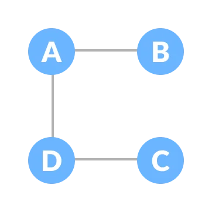
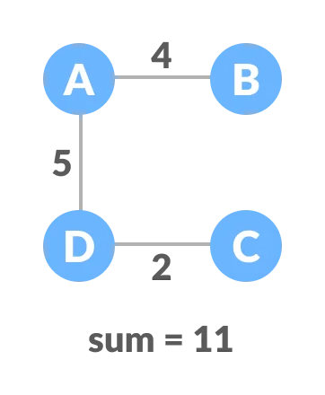

#### Weighted Graph

-   If the edges of the graph have weight, this **weight can represent factors** such as cost, complexing, literally anything.
-   The common application of weighted graph is finding a shortest path between two nodes.

#### Spanning Tree

-   A **Spanning Tree** is a sub-graph of an **undirected Connected Graph**, which includes all the vertices of the graph with a minimum possible number of edges. If a vertex is missed, then it is not a spanning tree.
-   The total number of spanning trees with n vertices that can be created from a complete graph is equal to $n^{(n-2)}$.
-   **Spanning Tree Types**
    -   **Minimum Spanning Tree**
        -   A **Minimum Spanning Tree** is a spanning tree in which the sum of the weight of the edges is as minimum as possible.
        -   The minimum spanning tree from a graph is found using the following algorithms:
            1.  Prim's Algorithm
            2.  Kruskal's Algorithm
    -   **Maximum Spanning Tree**
        -   A **Maximum Spanning Tree** is a spanning tree in which the sum of the weight of the edges is as maximum as possible.

#### Spanning Tree Example

|      Name       | Graph                                                            | Weighted Graph                                                            |
| :-------------: | :--------------------------------------------------------------- | :------------------------------------------------------------------------ |
|  Normal graph   |        |             |
| Spanning Tree 1 |  |  |
| Spanning Tree 2 |  |  |
| Spanning Tree 3 |  |  |
| Spanning Tree 4 |  |  |
| Spanning Tree 5 |  |                                                                           |
| Spanning Tree 6 |  |                                                                           |

#### Spanning Tree Applications

1. Computer Network Routing Protocol
2. Cluster Analysis
3. Civil Network Planning

#### Q: Create a Weighted Graph is composed of the following methods:

-   [x] [structure](#a-structure-of-a-weighted-graph)
-   [x] [add node](#a-add-node)
-   [x] [add edge](#a-add-edge)
-   [x] [shortest path](#a-shortest-path)
-   [x] [has cycle](#a-has-cycle)
-   [x] [minimum spanning tree](#a-minimum-spanning-tree)
-   [x] [contains node](#a-contains-node)

---

#### A: Structure of a Weighted Graph

```Java
public class WeightedGraph {
    private class Node {
        private String label;
        private List<Edge> edges = new ArrayList<>();

        public Node(String label) {
            this.label = label;
        }

        @Override
        public String toString() {
            return label;
        }

        public void addEdge(Node to, int weight) {
            edges.add(new Edge(this, to, weight));
        }

        public List<Edge> getEdges() {
            return edges;
        }
    }

    private class NodeEntry {
        private Node node;
        private int priority;

        public NodeEntry(Node node, int priority) {
            this.node = node;
            this.priority = priority;
        }
    }

    private class Edge {
        private Node from;
        private Node to;
        private int weight;

        public Edge(Node from, Node to, int weight) {
            this.from = from;
            this.to = to;
            this.weight = weight;
        }

        @Override
        public String toString() {
            return from + "->" + to;
        }
    }

    private Map<String, Node> nodes = new HashMap<>();

    public void print() {
        for (var node : nodes.values()) {
            var edges = node.getEdges();
            if (!edges.isEmpty())
                System.out.println(node + " is connected to " + edges);
        }
    }
}
```

---

#### A: add node

```Java
public void addNode(String label) {
    nodes.putIfAbsent(label, new Node(label));
}
```

---

#### A: add edge

```Java
public void addEdge(String from, String to, int weight) {
    var fromNode = nodes.get(from);
    if (fromNode == null)
        throw new IllegalArgumentException();

    var toNode = nodes.get(to);
    if (toNode == null)
        throw new IllegalArgumentException();

    fromNode.addEdge(toNode, weight);
    toNode.addEdge(fromNode, weight);
}
```

---

#### A: shortest path

```Java
private Path buildPath(Map<Node, Node> previousNodes, Node toNode) {
    Stack<Node> stack = new Stack<>();
    stack.push(toNode);
    var previous = previousNodes.get(toNode);
    while (previous != null) {
        stack.push(previous);
        previous = previousNodes.get(previous);
    }

    var path = new Path();
    while (!stack.isEmpty())
        path.add(stack.pop().label);

    return path;
}

public Path getShortestPath(String from, String to) {
    var fromNode = nodes.get(from);
    if (fromNode == null)
        throw new IllegalArgumentException();

    var toNode = nodes.get(to);
    if (toNode == null)
        throw new IllegalArgumentException();

    Map<Node, Integer> distances = new HashMap<>();
    for (var node : nodes.values())
        distances.put(node, Integer.MAX_VALUE);
    distances.replace(fromNode, 0);

    Map<Node, Node> previousNodes = new HashMap<>();
    Set<Node> visited = new HashSet<>();

    PriorityQueue<NodeEntry> queue = new PriorityQueue<>(
        Comparator.comparingInt(ne -> ne.priority)
    );
    queue.add(new NodeEntry(fromNode, 0));

    while (!queue.isEmpty()) {
        var current = queue.remove().node;
        visited.add(current);

        for (var edge : current.getEdges()) {
            if (visited.contains(edge.to))
                continue;

            var newDistance = distances.get(current) + edge.weight;
            if (newDistance < distances.get(edge.to)) {
                distances.replace(edge.to, newDistance);
                previousNodes.put(edge.to, current);
                queue.add(new NodeEntry(edge.to, newDistance));
            }
        }
    }

    return buildPath(previousNodes, toNode);
}
```

---

#### A: has cycle

```Java
public boolean hasCycle() {
    Set<Node> visited = new HashSet<>();

    for (var node : nodes.values()) {
        if (!visited.contains(node) &&
            hasCycle(node, null, visited))
        return true;
    }

    return false;
}

private boolean hasCycle(Node node, Node parent, Set<Node> visited) {
    visited.add(node);

    for (var edge : node.getEdges()) {
        if (edge.to == parent)
            continue;

        if (visited.contains(edge.to) || hasCycle(edge.to, node, visited))
            return true;
    }

    return false;
}
```

---

#### A: minimum spanning tree

```Java
public WeightedGraph getMinimumSpanningTree() {
    var tree = new WeightedGraph();

    if (nodes.isEmpty())
        return tree;

    PriorityQueue<Edge> edges = new PriorityQueue<>(
        Comparator.comparingInt(e -> e.weight)
    );

    var startNode = nodes.values().iterator().next();
    edges.addAll(startNode.getEdges());
    tree.addNode(startNode.label);

    if (edges.isEmpty())
        return tree;

    while (tree.nodes.size() < nodes.size()) {
        var minEdge = edges.remove();
        var nextNode = minEdge.to;

        if (tree.containsNode(nextNode.label))
            continue;

        tree.addNode(nextNode.label);
        tree.addEdge(minEdge.from.label, nextNode.label, minEdge.weight);

        for (var edge : nextNode.getEdges())
            if (!tree.containsNode(edge.to.label))
                edges.add(edge);
    }

    return tree;
}
```

---

#### A: contains node

```Java
public boolean containsNode(String label) {
    return nodes.containsKey(label);
}
```
